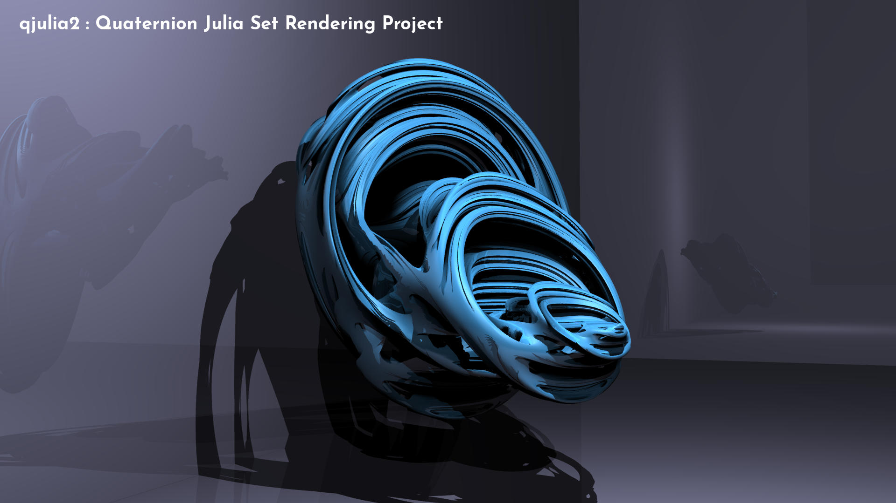

# qjulia2



## Overview

**Update 2020-03-05: Added a toy GUI based on Qt**

**Update 2020-03-29: Added CUDA support**

qjulia2 is a command-line ray-tracing program for rendering quaternion julia set.

The ray-tracing pipeline is inspired heavily from [*PBRT*](https://www.pbrt.org/),
while the distance estimation algorithm was learnt from [1] and [2].

Since 2020-03-29 CUDA support is added to grealy accelerate the rendering.

Currently the only supported image format is [PPM](http://netpbm.sourceforge.net/doc/ppm.html).
You will need to do conversion yourself to get any other format.

## Install

This project is developed and tested on Ubuntu 18.04 with CUDA 10.0.
[CMake](https://cmake.org/) is requred to build the project.

In addition, there are a few more dependencies:

* [libfmt](https://github.com/fmtlib/fmt)
* [glog](https://github.com/google/glog) (my plan is to remove it in the future)
* [CUDA](https://developer.nvidia.com/cuda-zone) (optional, if you want GPU acceleration)
* [gtest](https://github.com/google/googletest) (optional, if you want unit tests)
* [doxygen](http://www.doxygen.nl/) (optional, if you want its documentation)
* [Qt5](https://www.qt.io/) (optional, if you want the GUI, which is currently only a toy)

Also [cxxopts](https://github.com/jarro2783/cxxopts) is shipped as a submoudle,
I am thinking to switch to [CLI11](https://github.com/CLIUtils/CLI11) in the future.

The following CMake options are available to turn on/off optional features:

* *WITH_CUDA* CUDA acceleration
* *WITH_GUI* A toy GUI based on Qt
* *WITH_TEST* Unit test
* *WITH_DOC* Documentation pages

For example, if you want CUDA, you should do something like
```bash
mkdir build && cd build
cmake -DWITH_CUDA=ON ..
make -j8
```


## Usage

```bash
./src/qjulia2-cli -i ../data/example_scene.txt
```
There are a few options can be used:
* `-i <file>, --scene_file <file>`

  Specifies a scene description file. It describes what content to render.

* `-t <n>, --num_threads <n>`

  Specifies the number of threads used in rendering (if CUDA is not used).

* `-s <w>x<h>, --size <w>x<h>`

  Specifies the generated image size, i.e. "-s 1920x1080"

* `-o <file>, --output_file <n>`

  Specifies the output file name, which should end with ".ppm".
  By default "output.ppm".

For example, after you build the project under `<project_dir>/build`, you can do
```bash
./src/cli/qjulia-cli -i ../data/example.scene
```

## Scene Description

A scene description file consists a set of blocks, such as
```
Shape.Julia3D shape1 {
  SetConstant -0.2,0.8,0,0
}
```
Each block describes an enitty added to the scene builder.
A block begins with a line of header, in the following format 
```
<BASIC TYPE>.<SPECIFIC TYPE> <NAME> {
  ...
}
```

An example has been given in the `<project_dir>/data/example.scene`.

## TODOList

* Animation support
* Better GUI

## Reference

[1] Hart, John C., Daniel J. Sandin, and Louis H. Kauffman. "Ray tracing deterministic 3-D fractals." ACM SIGGRAPH Computer Graphics. Vol. 23. No. 3. ACM, 1989.

[2] https://www.cs.cmu.edu/~kmcrane/Projects/QuaternionJulia/paper.pdf
