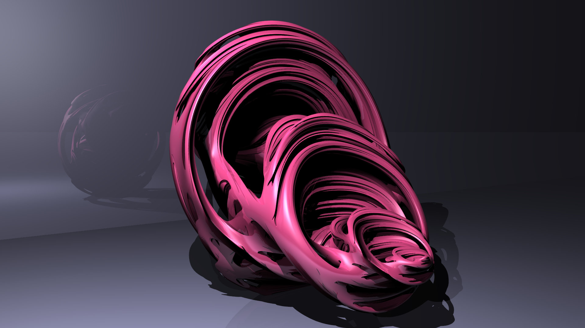

# qjulia2


## Overview

**Update 2020-04-21: Experimental GUI based on Qt5**

**Update 2020-04-03: Added Texture**

**Update 2020-03-29: Added CUDA support**

qjulia2 is a program for rendering quaternion julia set based on
ray-marching and distance estimation technologies. 
The code architecture is heavily inspired by [*PBRT*](https://www.pbrt.org/).
In addition, it can optionally use CUDA to accelerate the rendering.

The program was originally for command-line only.
Recently an experimental GUI based on Qt5 has been developed.

## Install

This project is developed and tested on Ubuntu 18.04 with CUDA 10.0.
[CMake](https://cmake.org/) is requred to build the project.

In addition, there are a few more dependencies:

* [libfmt](https://github.com/fmtlib/fmt)
* [glog](https://github.com/google/glog) (my plan is to remove it in the future)
* [CUDA](https://developer.nvidia.com/cuda-zone) (optional, if you want GPU acceleration)
* [gtest](https://github.com/google/googletest) (optional, if you want unit tests)
* [doxygen](http://www.doxygen.nl/) (optional, if you want its documentation)
* [Qt5](https://www.qt.io/) (optional, if you want the GUI, which is currently only a toy)
* [cxxopts](https://github.com/jarro2783/cxxopts) (shipped and compiled as a submoudle)

The following CMake options are available to turn on/off optional features:

* *WITH_CUDA* CUDA acceleration
* *WITH_GUI* GUI based on Qt (CUDA must be on)
* *WITH_TEST* Unit test
* *WITH_DOC* Doxugen Documentation

For example
```bash
mkdir build && cd build
cmake -DWITH_CUDA=ON -DWITH_GUI=ON -DWITH_TEST=ON -DWITH_DOC=ON ..
make -j8
```

I haven't written the CMake script for installing the program yet.
But you can directly run the program from the build directory.

## Command-line Usage

### Rendering an image

```bash
./src/qjulia2-cli -i ../data/example2.scene
```
There are a few options can be used:
* `-i <file>, --scene_file <file>`

  Specifies a scene description file. It describes what content to render.

* `-t <n>, --num_threads <n>`

  Specifies the number of threads used in rendering (if CUDA is not used).

* `-s <w>x<h>, --size <w>x<h>`

  Specifies the generated image size, i.e. "-s 1920x1080"

* `-o <file>, --output_file <n>`

  Specifies the output file name, which should end with ".ppm".
  By default "output.ppm".

For example, after you build the project under `<project_dir>/build`, you can do
```bash
./src/cli/qjulia-cli -i ../data/example.scene
```

### Scene Description

A scene description file consists a set of blocks, such as
```
Shape.Julia3D shape1 {
  SetConstant -0.2,0.8,0,0
}
```
Each block describes an enitty added to the scene builder.
A block begins with a line of header, in the following format 
```
<BASIC TYPE>.<SPECIFIC TYPE> <NAME> {
  ...
}
```

Examples have been given in `<project_dir>/data/*.scene`.


## GUI Usage

The GUI is currently experimental.
There isn't much of control at this moment but is enough to do some simple,
realtime interaction with the scene.

In the *Scene* tab you may select an entity
from the list and adjust its parameters.
Right now I only implement the control widgets for lights, cameras
and the fractal shapes.


In the *Render* tab you may specify the preview resolution when you are dragging the parameter sliders and the resolution when you stop adjusting.
High resolution image is slow to render in realtime even if you use CUDA acceleration.
Once you have made a good scene and found a good view, you may do an offline rendering and save it to an PNG file (PNG is the only supported format at this moment). This time you may use a higher resolution as you don't have to see it immediately.


## TODOList

* Depth of Field
* Animation support
* More resolution and less artifact

## Gallery




## Reference

[1] Hart, John C., Daniel J. Sandin, and Louis H. Kauffman. "Ray tracing deterministic 3-D fractals." ACM SIGGRAPH Computer Graphics. Vol. 23. No. 3. ACM, 1989.

[2] https://www.cs.cmu.edu/~kmcrane/Projects/QuaternionJulia/paper.pdf
